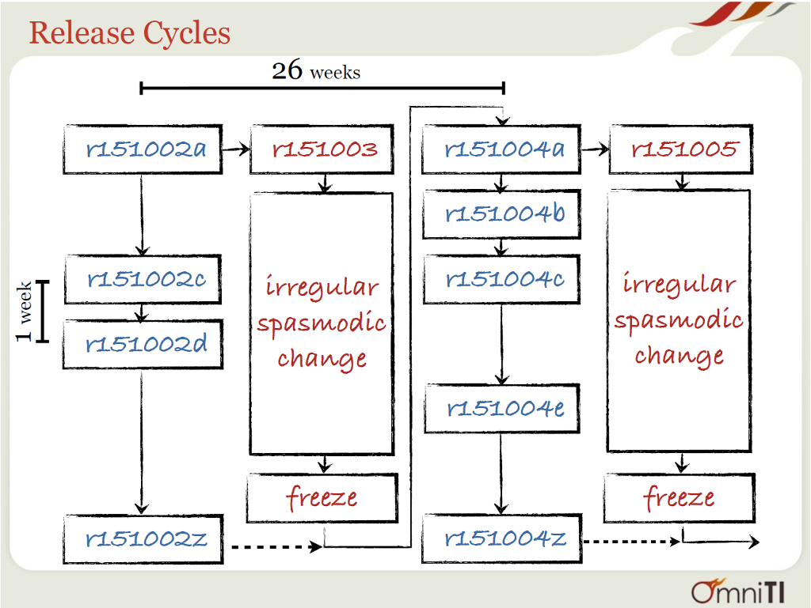

OmniOS Release Cycle
====================

Even-numbered releases are stable. Odd-numbered releases are unstable
(bloody). See [stable vs. bloody](StableVsBloody.md) for more details
on the difference between them.

Stable releases come out every 26 weeks. Interim, “weekly” updates to
stable follow a fixed schedule denoted by letters, one per week. Weekly
releases are made as needed. The first release of a new stable version
is synonymous with weekly release “a”, though the letter is not used.

During the intervals between stable releases, Bloody moves forward
rapidly, picking up changes from upstream illumos-gate and updating
various userland packages. Major goals for each interval are
[noted](Intervals.md).

The following image illustrates how releases progress.

Image from [OmniOS: Motivation and Design, LISA '12](http://www.slideshare.net/postwait/omnios-lisa-2012)
([video](https://www.usenix.org/conference/lisa12/omnios-motivation-and-design))

## Stable Support

Note: this plan went into effect as of r151006. Also note: r151022 had
an 8-month development cycles, due to upstream churn around r151022's
start.

Normal stable releases receive updates for one year. Long-Term Support
releases receive updates for three years. LTS releases are staggered
every two years, with [r151006](ReleaseNotes/r151006.md) being the
first. Releases in **bold** are currently receiving support.

| Release     | Type   | Release Date                       | Updates Until |
|-------------|--------|------------------------------------|---------------|
| r151006     | LTS    | [H1 2013](ReleaseNotes/r151006.md) | H1 2016       |
| r151008     | normal | [H2 2013](ReleaseNotes/r151008.md) | H2 2014       |
| r151010     | normal | [H1 2014](ReleaseNotes/r151010.md) | H1 2015       |
| r151012     | normal | [H2 2014](ReleaseNotes/r151012.md) | H2 2015       |
| r151014     | LTS    | [H1 2015](ReleaseNotes/r151014.md) | H1 2017       |
| r151016     | normal | [H2 2015](ReleaseNotes/r151016.md) | H2 2016       |
| r151018     | normal | [H1 2016](ReleaseNotes/r151018.md) | H1 2017       |
| r151020     | normal | [H2 2016](ReleaseNotes/r151020.md) | H1 2017       |
| **r151022** | LTS    | [H1 2017](ReleaseNotes/r151022.md) |               |

## Supported Upgrades

Upgrades are supported from the most previous version in a given track
(Stable vs. LTS) for the life of a given release. For example, upgrades
from r151008 to r151010 will be supported for 1 year after the release
of r151010, but not upgrades from r151006 to r151010. Upgrades from
r151006 will be supported to r151014 for 3 years after the release of
r151014.
